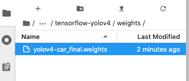
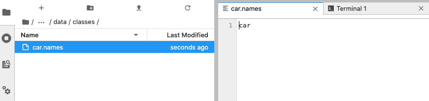
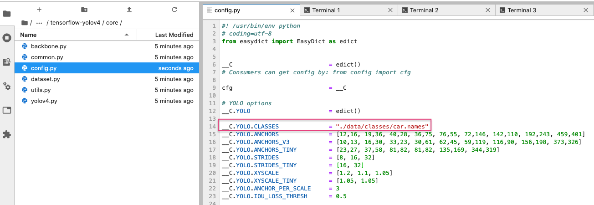
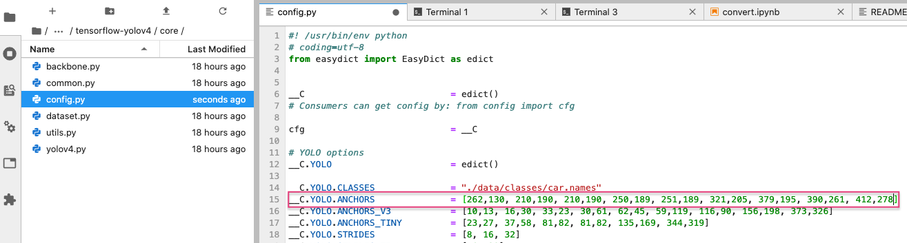
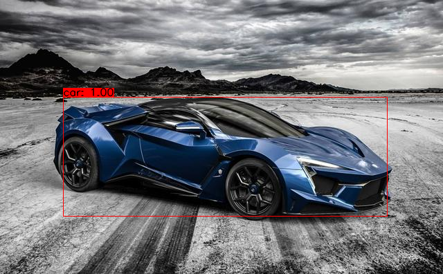

# tensorflow-yolov4
本專案是 Tensorflow 版本 YOLOv4 實例，大家可以使用 darknet 訓練好的 `.weight` 權重，複製到此專案中並轉成 Tensorflow 權重並進行推論。

## Installation
install the project dependencies.

```
# for GPU
pip install -r requirements-gpu.txt
# for CPU
pip install -r requirements.txt
```


## 使用方式
### 複製 darknet 權重
首先將[yolov4-darknet](https://github.com/andy6804tw/yolov4-darknet)所訓練好的 `yolov4-car_final.weights` 放到 weights 資料夾中。



### 定義 class name
我們需要進入 `data/classes` 資料夾中新增一個 `car.names` 的檔案，裡面需要列出欲偵測物品的 class 名稱。有幾個類別就必須要有相對應的類別名稱數目。



`car.names` 建立完成後，接著進入 `core/` 資料夾中開啟 `config.py` 。找到第14行並將路徑指定成剛剛所建立的 `car.names`。


### 修改 anchors
還記得在 darknet 訓練時有設定 anchors 嗎？在這裡我們需要將 anchors 填入當時訓練時所設定的參數。因此我們要再開啟 `config.py` 修改地15行的 `__C.YOLO.ANCHORS`。



### darknet 權重轉換成 Tensorflow 格式
確認修改 `classes` 與 `anchors` 後就可以透過以下指令轉換成 Tensorflow 權重了。

```
!python save_model.py --weights ./weights/yolov4-car_final.weights --output ./checkpoints/yolov4-car_final-416 --input_size 416 --model yolov4 
```

### 測試圖片
權重轉換後就可以立即測試一張圖片辨識。剛轉換成功的權重會儲存在 `checkpoints/` 資料夾中。指定好相對應的權重(--weights ./checkpoints/yolov4-car_final-416)，並註明影像大小(--size 416)以及所使用的模型(--model yolov4)。以及預測是的影像(--image ./data/test.jpg)。
```
python detect.py --weights ./checkpoints/yolov4-car_final-416 --size 416 --model yolov4 --image ./data/test.jpg
```



> 如果不想使用指令方式執行預測，可以參考 `detect.ipynb` 省去每次載入模型時間

### 測試影片

```
python detectvideo.py --weights ./checkpoints/yolov4-car_final-416 --size 416 --model yolov4 --video ./data/traffic.mov --output_format MP4V --output result.mp4
```


> 如果不想使用指令方式執行預測，可以參考 `detectvideo.ipynb` 省去每次載入模型時間